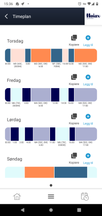

# MyUplink Schedule changer

This program connect to the myuplink.com and adjust the schedule of [Høiax CONNECTED](https://www.hoiax.no/om-hoiax/articles/hoiax-connected-smart-varmtvannsbereder-med-skylosning) hot water heaters, and adjust the schedule so that it uses electricity when the price is lowest. This is done by fetching price information on a pr hour basic, for today and tomorrow and building the schedule
It also allows you to periodicity publish current values from the heater via mqtt to your home automation of choice.
When changing the schedule it gets the price information for your region from [transparency.entsoe.eu](https://transparency.entsoe.eu) or other 3d parti API.

### Schedule building rules

#### Old method
Water heater will heat water when its bellow a certain temprature, without considering price. Considering alot of showing and cooking happens around the same time, this means heating water at peak electricity price.

#### Price based rules (Default)
This schedule builder simply uses cost, and will schedule heating the water (Consider charting a batteri) when the prices are low.  Using this method you might end up heating up the water many hours away from using it.

#### Energi based rules
This schedule builder is provided configured peak times, and will attemt to use cheapest posible electricity to heat the tank to reach a target energi level in the tank.

## Legal

This is a 3d party program made to work against [myuplink](https://myuplink.com), and not afflilated with them in any way.

## How to use

1) Download the program.
2) Configure the application.json
3) Install with *myuplink install* (Or you can just run it)
4) Start the service or reboot ( MyUplink-smartconnect.exe start )

Deploy via docker:
<https://hub.docker.com/r/erlingsaeterdal/myuplinksmartconnect>

## Future plan

- Full integration with home assistant as a integration? ( This depends a bit on having someone know the homeassistant part, to help build a homeassistant integration that can connect to the docker container over MTQQ)

*How far this is taken depends alot of to what degree others use it*

## Configuration explained:

- UserName - Your username to myuplink.com ( Sadly the public facing APi, does not allow for reschedules..)
- Password - Your password for myuplink.com
- ConsoleLogLevel - Sets the logs shown in the console window (Default Information), posible values Verbose,Debug,Information,Warning,Error,Fatal

## Heating schedule based settings

- ChangeSchedule - Change schedule automaticly based on defined rules (Default on.)
- EnergiBasedCostSaving - Energi based rules instead of pure price based ( More below ).
- WaterHeaterMaxPowerInHours - This is the number of hours pr day the water heater is running full power.
- WaterHeaterMediumPowerInHours - This the number of hours pr day the water heater is running at half power, but with a lower "target temperature"
- MediumPowerTargetTemperature - Target temperature in medium mode, default 50c
- HighPowerTargetTemperature - Target temperature in high mode, default 70c
- EnergiBasedPeakTimes - When using Energi based rules, this sets the target where the water should be at HighPowerTargetTemperature.

## Optional mqtt Configuration, used to connect to smarthouse solution like homeassistant

- MQTTServer - IP address or FQDN of mqtt, this is optional.
- MQTTServerPort - The port of the mqtt server, this is optional.
- MQTTUserName - If the mqtt requires username and passord.
- MQTTPassword - If the mqtt requires username and passord.
- MQTTLogLevel - Sets the logs shown in the console window (Default Warning), posible values Verbose,Debug,Information,Warning,Error,Fatal

## Recommended configuration.

This works for my famility, with 1 adult male and a wife. Both taking showers that last 10+ min pr day.

- WaterHeaterMaxPowerInHours = 5
- WaterHeaterMediumPowerInHours = 10

 *Heater should be in schedule mode.*
*If your wondering how many hours pr day the water heater is potensialy on, please combine the 2 above numbers.*

## FAQ

Q) What are the different scheduling rules

> Simple price based ( Default) - This rule is very simple we use the WaterHeaterMaxPowerInHours/WaterHeaterMediumPowerInHours and run the heater in the cheapest hours.
> Energi based - In this mode, we attemt to use WaterHeaterMaxPowerInHours/WaterHeaterMediumPowerInHours to make sure we reach a target energi at targeted times.

Q) What are modes and how are they used?

> The heater has 5 different modes ( Mode is a combination of target temperature for water and how much power to use to heat it.), this program uses 3 of them ( And will automaticly configure this)
> M6: Target temp 70c ( 2000w)
> M5: Target temp 50c ( 700w)
> M4: Target temp 50c ( 0w)
> It will then use these modes based on electricity price.

Q) When does the application change the schedule?

> The application will change the schedule at a set thats different for each user. You will see you time in the logs ( [16:47:05 INF] Target Schedule change time is 15:17  ) We spread out the load of when to change the schedule, simply because having all heaters >attemting to do it at the same is bad practice and might overload the remote apis.

Q) Can i force it to update the schedule?
> Yes, if you restart the service/docker after the target schedule change time ( But before midnight), it will force a schedule update.

## Setup Homeassistant sensor, in configuration.yml

18760NE2240322014631 needs to be replaced with the ID of your hotwater heater, simplest way to find out is to just read the console output of this application*

>      sensor:
>        - platform: mqtt
>          state_topic: "heater/18760NE2240322014631/TargetTemprature"
>          unique_id: "WaterHeaterTargetTemperature"
>          name: "Target temprature"
>          unit_of_measurement: "°C"
>          
>        - platform: mqtt
>          state_topic: "heater/18760NE2240322014631/CurrentTemprature"
>          unique_id: "WaterHeaterCurrentTemperature"
>          name: "Current temprature"
>          unit_of_measurement: "°C"
>          
>        - platform: mqtt
>          state_topic: "heater/18760NE2240322014631/EstimatedPower"
>          unique_id: "WaterHeaterEstimatedPower"    
>          name: "Current Watt"
>          device_class: power    
>          state_class: measurement    
>          unit_of_measurement : W   
>         
>       - platform: mqtt
>         state_topic: "heater/18760NE2240322014631/EnergyTotal"
>         unique_id: "WaterHeaterEnergyTotal"
>         name: "Energy Total"    
>         device_class: power
>         state_class: total_increasing
>         unit_of_measurement : kWh    
>         
>       - platform: mqtt
>         state_topic: "heater/18760NE2240322014631/EnergiStored"
>         unique_id: "WaterHeaterEnergiStored"
>         name: "Energi in tank"
>         device_class: power
>         unit_of_measurement : kWh        
>         
>       - platform: mqtt
>         state_topic: "heater/18760NE2240322014631/FillLevel"
>         name: "Tank fill level"
>         unique_id: "WaterHeaterFillLevel"    
>         unit_of_measurement: '%'
> 
>       - platform: mqtt
>         state_topic: "heater/18760NE2240322014631/LastScheduleChangeInHours"
>         name: "Last schedule change"
>         unique_id: "LastScheduleChange"
> 
>       - platform: mqtt
>         state_topic: "heater/LogEntry"
>         name: "MyUplinkSmartConnectLogs"
>         unique_id: "MyUplinkSmartConnectLogs"
> 
>       - platform: mqtt
>         state_topic: "heater/ServiceStatus"
>         name: "MyUplinkSmartConnect status"
>         unique_id: "MyUplinkSmartConnectStatus"